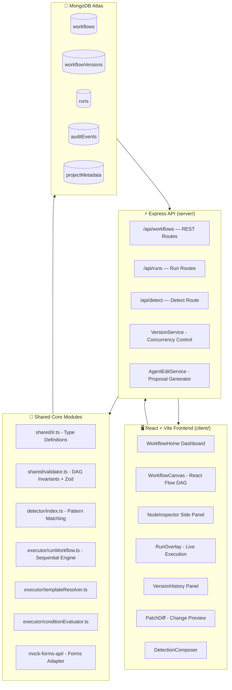

<div align="center">

# ⚡ FlowTrace

### Design, Validate, and Execute Business Workflows as Directed Acyclic Graphs

[](https://flowtrace-eu2k.onrender.com)
[](https://www.typescriptlang.org/)
[](https://react.dev/)
[](https://expressjs.com/)
[](https://www.mongodb.com/atlas)
[](https://vitest.dev/)

<br/>

**[🚀 Live Demo](https://flowtrace-eu2k.onrender.com)** &nbsp;·&nbsp; **[⚙️ Run Locally](#-local-development)** &nbsp;·&nbsp; **[📖 API Reference](#-api-reference)** &nbsp;·&nbsp; **[🏗️ Architecture](#-architecture)**

</div>

---

## 🚀 Live Demo

> **Try it now — no installation required.**
>
> **[https://flowtrace-eu2k.onrender.com](https://flowtrace-eu2k.onrender.com)**

Open the live application in your browser. Three pre-seeded demo workflows are ready to explore:
- **Order Placed Process** — fraud check → invoice → confirmation email → fulfillment alert
- **Asset Request Approval** — conditional branching on approval/rejection with redirect failure policy
- **User Registration Process** — identity verification → welcome email → Slack team alert

---

## 🧭 What is FlowTrace?

FlowTrace is a **workflow engineering platform** that lets you model, validate, visualize, and execute multi-step business processes as **Directed Acyclic Graphs (DAGs)**.

Instead of hand-crafting workflow configurations or relying on opaque BPMN tooling, FlowTrace provides:

- A **typed Intermediate Representation (IR)** that describes triggers, nodes, edges, conditions, and failure policies
- A **structural validator** that enforces DAG invariants (no cycles, no dangling references, valid ancestor-only step references)
- A **sequential executor** that resolves template variables, evaluates conditions, and applies failure policies at runtime
- A **visual DAG canvas** built with React Flow where you can inspect and edit workflows in real time
- A **version-controlled persistence layer** on MongoDB Atlas with optimistic concurrency control

Every workflow is a first-class data structure — not a bag of YAML or a hardcoded function chain.

---

## 🤔 Why FlowTrace?

| Problem | FlowTrace Approach |
|---|---|
| Business workflows buried in imperative code | Model workflows as typed, inspectable data with a strict schema |
| No validation until runtime failures | DAG invariants enforced **before** execution — cycles, self-loops, dangling edge references, invalid step references all caught at save/publish time |
| Impossible to safely modify live workflows | Optimistic concurrency control via version headers prevents conflicting edits; every mutation creates an immutable version snapshot |
| Template variable chaos | `{{trigger.x}}` and `{{stepId.x}}` are resolved and validated — you cannot reference a step that is not your topological ancestor |
| Failure handling is an afterthought | Per-node **failure policies**: `abort`, `skip`, or `redirect` to any valid node |
| Audit trails are missing | Every edit, save, and publish writes an immutable audit event |

---

## ✨ Key Features

### 🕸️ Visual DAG Canvas
Interactive workflow graph powered by **React Flow**. Nodes, edges, and conditional branching paths are rendered visually. Click any node to inspect its action, inputs, conditions, and failure policy in the side inspector.

### 🧩 Typed Intermediate Representation (IR)
Every workflow is described in a canonical TypeScript IR — `Trigger`, `Node`, `Edge`, `Condition`, `FailurePolicy`, `Run`, `StepResult`. The IR is shared between the frontend, backend, detector, executor, and validator with zero drift.

```typescript
// shared/ir.ts
interface Node {
  id: string;
  name: string;
  type: 'action' | 'form';
  action: string;                       // e.g. "FraudService.check"
  inputs: Record<string, unknown>;      // supports {{trigger.x}} templates
  condition?: Condition;                // pre-condition for execution
  failurePolicy?: FailurePolicy;        // abort | skip | redirect
}
```

### ✅ Structural Validator
`shared/validator.ts` enforces all DAG invariants **before** any workflow can be published or executed:

- Duplicate node / edge ID detection
- Edge references to non-existent nodes
- Self-loop detection
- **Cycle detection** via depth-first search on the adjacency list
- Invalid `redirectTargetId` in failure policies
- Template variable references that point to non-ancestor nodes (topological ancestor check)

### 🔄 Sequential Executor with Template Resolution
`executor/runWorkflow.ts` executes published workflows step by step:

1. Loads the immutable published version from MongoDB
2. Validates the trigger payload against the trigger JSON Schema
3. Creates a `Run` record in the database
4. Executes nodes in **topological order**
5. Resolves `{{trigger.x}}` and `{{stepId.outputKey}}` template variables dynamically
6. Evaluates edge conditions (`eq`, `neq`, `gt`) to determine traversal paths
7. Applies per-node failure policies (`abort`, `skip`, `redirect`) on errors
8. Persists step results and a final audit event

### 📦 Immutable Version History
Every save creates a new version snapshot in `workflowVersions`. Publishing requires passing the exact `baseVersion` to prevent stale overwrites. Full version history is browsable in the UI via the **Version History** panel.

### 🔍 Workflow Detector
`detector/index.ts` parses text requirements and deterministically maps them to known workflow patterns using phrase/keyword matching, returning a confidence score, explanation, warnings, and a fully validated IR draft.

### 📝 JSON Patch Diff View
Before saving, the **PatchDiff** panel shows you exactly what changed as structured `add`, `replace`, and `remove` operations — no surprises.

### 🏃 Live Run Overlay
Execute a workflow from the UI, supply the trigger payload, and watch the run unfold — each node transitions from `pending` → `running` → `success | failed | skipped` with live polling.

### 🧪 Comprehensive Test Suite
**232 tests** across **25 test files** using **Vitest**, covering:
- DAG validation invariants
- Executor execution paths (success, failure, redirect, skip, abort)
- Template variable resolution
- Condition evaluation
- API route integration
- Version lifecycle (draft → publish → history)
- MongoDB persistence repositories
- Optimistic concurrency (409 conflict detection)
- Demo reset idempotency

---

## 🏗️ Architecture

### System Overview



### Data Flow

```
Text Requirement
      │
      ▼
detector/index.ts          ← deterministic pattern matching
      │  DetectionResult { workflow IR, confidence, warnings }
      ▼
shared/validator.ts        ← Zod schema + DAG invariants
      │  ValidationResult { success, errors[] }
      ▼
persistence/               ← VersionService.createWorkflow()
      │  Immutable workflowVersion document
      ▼
POST /api/workflows/:id/publish
      │  Optimistic concurrency check (baseVersion header)
      ▼
executor/runWorkflow.ts    ← POST /api/workflows/:id/run
      │  Topological traversal, template resolution, conditions
      ▼
MongoDB runs collection    ← per-step StepResult, audit event
      │
      ▼
React RunOverlay           ← polled live run status
```

### MongoDB Collections

| Collection | Description |
|---|---|
| `workflows` | Logical workflow records (ID, name, status, latest version, publishedVersionId) |
| `workflowVersions` | Immutable version snapshots (trigger, nodes, edges per version number) |
| `runs` | Execution records (trigger payload, per-step results, run status) |
| `auditEvents` | Append-only log of every edit, publish, and run event |
| `projectMetadata` | Project-level metadata (forms, functions, buttons, operations catalogs) |

---

## 🔌 API Reference

| Method | Path | Description |
|---|---|---|
| `GET` | `/api/workflows` | List all workflows |
| `POST` | `/api/workflows` | Create a new workflow |
| `GET` | `/api/workflows/:id` | Get workflow (with optional `?version=N`) |
| `PATCH` | `/api/workflows/:id` | Save a new draft version (requires `x-base-version` header) |
| `POST` | `/api/workflows/:id/validate` | Validate workflow IR without saving |
| `POST` | `/api/workflows/:id/publish` | Publish a version (requires `baseVersion`) |
| `GET` | `/api/workflows/:id/history` | List all version snapshots |
| `DELETE` | `/api/workflows/:id/versions/:n` | Delete a specific version |
| `POST` | `/api/workflows/:id/run` | Execute a published workflow with a trigger payload |
| `POST` | `/api/workflows/:id/agent-edit` | Generate a structured edit proposal from a prompt |
| `POST` | `/api/detect` | Detect workflow pattern from a text requirement |
| `GET` | `/health` | Health check + MongoDB connectivity ping |

All mutation endpoints that create new versions require the `x-base-version` header (or `baseVersion` query param) for **optimistic concurrency control**. A stale version returns `409 Conflict`.

---

## 🛠️ Tech Stack

| Layer | Technology |
|---|---|
| Frontend | React 18, TypeScript, Vite, React Flow |
| Backend | Node.js, Express 4, TypeScript |
| Database | MongoDB Atlas (native driver) |
| Validation | Zod (schema), custom DAG validator |
| Testing | Vitest, 232 tests, 25 test files |
| Build | pnpm workspaces, Vite, tsc |
| Deployment | Single-service on Render (Express serves React static build + API) |
| Package Manager | pnpm |

---

## 💻 Local Development

### Prerequisites

- **Node.js** v18+
- **pnpm** v8+ (`npm install -g pnpm`)
- **MongoDB Atlas** cluster (or local MongoDB)

### 1. Clone & Install

```bash
git clone https://github.com/brijeshearn12-dotcom/flowtrace.git
cd flowtrace
pnpm install
```

### 2. Configure Environment

```bash
cp .env.example .env
```

Edit `.env`:

```env
MONGODB_URI=mongodb+srv://<user>:<password>@<cluster>.mongodb.net/flowtrace
PORT=3001
```

### 3. Seed the Database

```bash
pnpm run seed
```

Creates three demo workflows in published state: Order Placed, Asset Request Approval, and User Registration.

### 4. Start All Dev Servers

```bash
pnpm run dev
```

| Process | URL | Description |
|---|---|---|
| React (Vite HMR) | http://localhost:5173 | Frontend |
| Express API | http://localhost:3001 | REST API |
| Mock Forms API | http://localhost:3002 | Deterministic mock for execution |

### Available Scripts

```bash
pnpm run dev              # Start all three dev servers concurrently
pnpm run build            # Build frontend + compile TypeScript server
pnpm start                # Run production build (serves frontend + API on port 3001)
pnpm test                 # Run full test suite (232 tests, isolated test DB)
pnpm run seed             # Seed demo workflows
pnpm run demo:reset       # Reset demo workflows without affecting custom ones
pnpm run typecheck        # Full TypeScript type check
pnpm run lint             # ESLint across all TypeScript files
```

---

## 🧪 Testing

Tests run against an isolated `flowtrace_test` database — your development data is never touched.

```bash
pnpm test
```

```
Test Files  24 passed (24)
     Tests  232 passed (232)
  Duration  ~136s
```

---

## 🚢 Production Deployment

FlowTrace runs as a **single-service** on Render:

```
GitHub push
    │
    ▼
Render Build: pnpm run build
    │
    ▼
Render Start: pnpm start
    │
    ▼
Express (port from env)
    ├── /api/*      → REST API routes
    ├── /health     → health check
    └── /*          → React SPA (dist/client/index.html)
```

**Live URL:** [https://flowtrace-eu2k.onrender.com](https://flowtrace-eu2k.onrender.com)

| Environment Variable | Description |
|---|---|
| `MONGODB_URI` | MongoDB Atlas connection string |
| `PORT` | Server port (set automatically by Render) |
| `CLIENT_URL` | Allowed CORS origin |

---

## 📁 Project Structure

```
flowtrace/
├── client/                  # React + Vite frontend
│   ├── components/          # WorkflowCanvas, NodeInspector, RunOverlay,
│   │                        #   PatchDiff, VersionHistory, TriggerPanel,
│   │                        #   DetectionComposer, NodeEditor, RunLog
│   ├── pages/               # WorkflowHome (dashboard)
│   └── styles/              # CSS design tokens + responsive layout
│
├── server/                  # Express API server
│   ├── routes/              # workflows.ts, runs.ts, detect.ts
│   ├── services/            # VersionService, AgentEditService
│   └── index.ts             # Bootstrap, static serving, CORS
│
├── shared/                  # Framework-agnostic (used by all layers)
│   ├── ir.ts                # Canonical type definitions
│   ├── validator.ts         # DAG invariant validator
│   └── schemas.ts           # Zod schemas for IR types
│
├── detector/                # Text → IR pattern matcher
│   └── index.ts             # Deterministic keyword matching engine
│
├── executor/                # Workflow execution engine
│   ├── runWorkflow.ts       # Main sequential executor
│   ├── templateResolver.ts  # {{trigger.x}} / {{step.x}} resolution
│   ├── conditionEvaluator.ts# Edge and node condition evaluation
│   └── formsAdapter.ts      # IFormsAdapter interface
│
├── persistence/             # MongoDB typed repositories
├── mock-forms-api/          # Deterministic mock forms service
├── seed/                    # Database seed scripts
├── tests/                   # 25 Vitest test files (232 tests)
└── docs/                    # Architecture, API contract, data model docs
```

---

## 📄 Documentation

| Document | Contents |
|---|---|
| [`docs/architecture.md`](./docs/architecture.md) | System topology and component responsibilities |
| [`docs/api-contract.md`](./docs/api-contract.md) | Full API contract with request/response examples |
| [`docs/data-model.md`](./docs/data-model.md) | MongoDB collection schemas |
| [`docs/execution-semantics.md`](./docs/execution-semantics.md) | DAG invariants, execution algorithm, failure policies |
| [`docs/architecture-decisions.md`](./docs/architecture-decisions.md) | Key design decisions and trade-offs |

---

<div align="center">

Built with TypeScript · React · Express · MongoDB Atlas · React Flow · Vitest · pnpm

**[🚀 Try the Live Demo](https://flowtrace-eu2k.onrender.com)**

</div>
