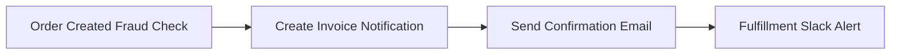
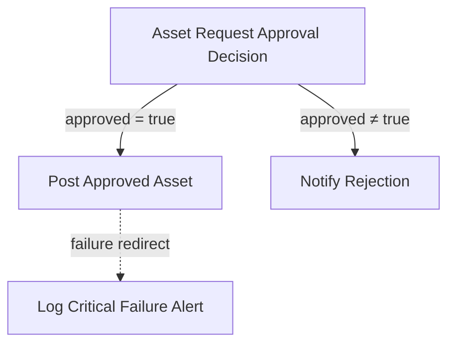
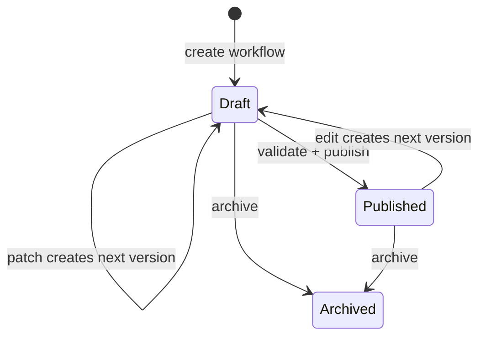
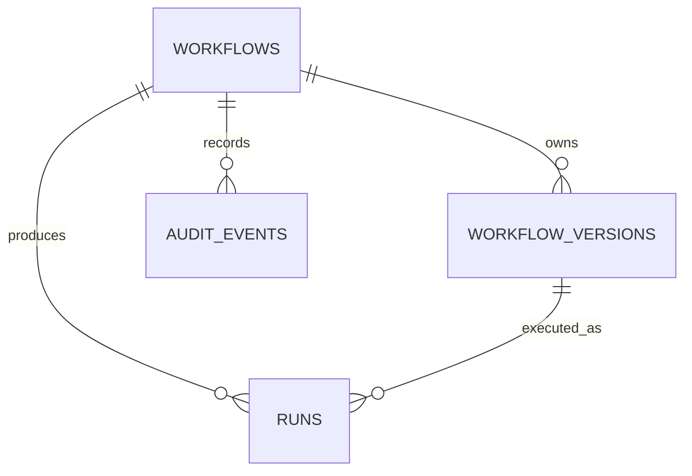

# FlowTrace

> **A version-safe workflow definition service for turning business processes into validated, traceable workflow graphs.**

FlowTrace addresses a practical governance problem: business workflows change often, but unsafe edits can break operations or erase the context needed to understand what changed. This MVP provides a typed workflow model, graph validation, immutable version snapshots, optimistic concurrency protection, and MongoDB persistence—giving teams a safe foundation for workflow automation.

[](https://www.typescriptlang.org/) [](https://nodejs.org/) [](https://expressjs.com/) [](https://www.mongodb.com/) [](https://react.dev/)

## Contents

- [🎯 Problem](#-problem)
- [💡 Solution](#-solution)
- [Why FlowTrace?](#why-flowtrace)
- [✨ Core Features](#-core-features)
- [🧪 Demo Workflows](#-demo-workflows)
- [🏗️ Architecture](#️-architecture)
- [🔄 Version Lifecycle](#-version-lifecycle)
- [🗄️ Data Model](#️-data-model)
- [🔌 API](#-api)
- [🧰 Tech Stack](#-tech-stack)
- [📁 Project Structure](#-project-structure)
- [🚀 Getting Started](#-getting-started)
- [✅ Verification](#-verification)
- [MVP Scope](#mvp-scope)

## 🎯 Problem

Operational processes—such as order fulfilment and asset approvals—are multi-step, conditional, and frequently revised. When their definitions are changed informally, an invalid edge, a circular dependency, or an edit based on an old version can silently compromise the process.

FlowTrace treats a workflow as a governed graph. It validates the definition before it is saved or published, preserves every version as a snapshot, and rejects stale edits rather than overwriting newer work. The result is a workflow foundation that is inspectable, reproducible, and ready to support controlled execution.

## 💡 Solution

FlowTrace implements the lifecycle below for manually triggered workflow definitions:

```text
Define → Validate → Draft a new version → Publish → Inspect history → Archive
```

The Express API owns the business rules; a service creates and publishes versions; repositories isolate MongoDB access; and a shared TypeScript IR plus Zod schemas keep API and persistence data consistent. A seeded metadata catalog records the available forms, functions, buttons, and comparison operators for the project.

## Why FlowTrace?

| Workflow risk | FlowTrace approach |
|---|---|
| Broken graph connections | Validates node references and self-loops |
| Circular dependencies | Enforces a directed acyclic graph (DAG) |
| Unsafe data dependencies | Allows step references only from ancestor steps |
| Invalid fallback destination | Checks failure-redirect targets |
| Silent overwrite from concurrent edits | Requires a matching `baseVersion` and returns `409` for stale edits |
| Losing the published configuration | Stores each version as a separate immutable snapshot |
| Unclear workflow evolution | Exposes version history and preserves archived workflow versions |

## ✨ Core Features

### Workflow management

- Create, list, fetch, validate, patch, publish, and inspect history through REST endpoints.
- Model manual triggers, action/form nodes, directed edges, conditions (`eq`, `neq`, `gt`), and failure policies (`abort`, `skip`, `redirect`).
- Seed two realistic, published example workflows for a repeatable local demo.

### Version safety

- Every edit creates a new workflow-version document; it never changes the source snapshot.
- Publishing moves the workflow’s published-version pointer to a validated snapshot.
- JSON Patch edits require `baseVersion` through `x-base-version` or `?baseVersion=`.
- A stale base version is rejected with `409 Conflict` before a new draft is written.
- Archiving changes lifecycle status without deleting version history.

### Validation

Validation runs at workflow creation, draft creation, explicit validation, and publishing. It checks:

- Zod shape and enum constraints
- duplicate node and edge IDs
- missing node references and self-loops
- cycles in the workflow DAG
- redirect failure-policy targets
- template references such as `{{trigger.orderId}}` and `{{previousStep.output}}`
- ancestry, so a node cannot read output from a downstream or unrelated node

### Persistence foundation

MongoDB repositories are implemented for workflow headers, workflow versions, metadata, runs, and audit-event documents. The current HTTP API uses the workflow and version repositories; run and audit repositories are present as the persistence base for the execution/audit phases.

## 🧪 Demo Workflows

### `OrderPlaced`

The seeded **Order Placed Process** demonstrates a straightforward sequential graph. Its manual trigger requires `orderId`, `customerEmail`, and `total`.



### `AssetRequestApproval`

The seeded **Asset Request Approval Process** demonstrates conditional routing. Its trigger requires `requestId`, `approved`, and `amount`. A true `approved` value routes to the dispatch notification; any other value routes to rejection notification. The approved action also declares a redirect failure policy to a critical-failure alert.



The failure policy and conditional edges are stored and validated in the current MVP; runtime execution of those paths is the next implementation phase.

## 🏗️ Architecture

```mermaid
flowchart TD
  Client[React + Vite client\n(current starter UI)] --> API[Express API routes]
  API --> Service[VersionService\nLifecycle and concurrency rules]
  API --> Validator[Shared Zod + DAG validator]
  Service --> Repos[Typed repositories]
  Repos --> Mongo[(MongoDB)]
  Mongo --- Workflows[workflows]
  Mongo --- Versions[workflowVersions]
  Mongo --- Metadata[projectMetadata]
  Mongo --- Runs[runs]
  Mongo --- Audits[auditEvents]
```

- **Routes** are the HTTP boundary for workflow operations.
- **VersionService** applies patches, validates candidate drafts, publishes versions, and archives workflows.
- **Shared IR and validator** provide one canonical model and graph safety rules.
- **Repositories** isolate MongoDB collection access from API and service code.
- **MongoDB** stores logical workflow headers separately from their version snapshots.

## 🔄 Version Lifecycle



Published snapshots remain intact because editing always derives a new version document. For example, if developer A begins from version 3, developer B advances the workflow to version 4, and A submits an edit with `baseVersion=3`, FlowTrace rejects it as stale. This prevents an accidental overwrite of version 4 and asks the caller to rebase on the latest version.

## 🗄️ Data Model

| Collection | Purpose | Important fields |
|---|---|---|
| `projectMetadata` | Seeded project catalog | `key`, `value`, `updatedAt` |
| `workflows` | Logical workflow and lifecycle pointers | `_id`, `name`, `status`, `latestVersion`, `publishedVersionId` |
| `workflowVersions` | Immutable workflow configuration snapshots | `workflowId`, `version`, `trigger`, `nodes`, `edges` |
| `runs` | Persistence model for execution instances | `workflowId`, `workflowVersionId`, `status`, `triggerPayload`, `results` |
| `auditEvents` | Persistence model for change/execution records | `actor`, `action`, `entityType`, `entityId`, `payload` |



## 🔌 API

Base URL: `http://localhost:3001`

| Method | Endpoint | Purpose |
|---|---|---|
| `GET` | `/health` | Check API and MongoDB connectivity |
| `GET` | `/api/workflows` | List workflow headers |
| `POST` | `/api/workflows` | Create an empty draft workflow |
| `GET` | `/api/workflows/:id` | Get a workflow version; optional `?version=n` |
| `PATCH` | `/api/workflows/:id` | Create a patched draft from a required base version |
| `POST` | `/api/workflows/:id/validate` | Validate the latest version |
| `POST` | `/api/workflows/:id/publish` | Publish the latest validated version |
| `GET` | `/api/workflows/:id/history` | List workflow-version snapshots, newest first |

Create a workflow:

```bash
curl -X POST http://localhost:3001/api/workflows \
  -H "Content-Type: application/json" \
  -d '{"id":"wf_returns","name":"Returns Process"}'
```

Create a new draft using JSON Patch and optimistic concurrency:

```bash
curl -X PATCH "http://localhost:3001/api/workflows/wf_returns?baseVersion=1" \
  -H "Content-Type: application/json" \
  -d '[{"op":"add","path":"/nodes/0","value":{"id":"notify","name":"Notify team","type":"action","action":"Slack.post","inputs":{"message":"Return received"}}}]'
```

Validate and publish the latest version:

```bash
curl -X POST http://localhost:3001/api/workflows/wf_returns/validate
curl -X POST http://localhost:3001/api/workflows/wf_returns/publish
```

## 🧰 Tech Stack

| Layer | Technology | Role |
|---|---|---|
| Language | TypeScript | Shared domain model and backend implementation |
| API | Node.js, Express | REST API and health check |
| Database | MongoDB, MongoDB Node.js driver | Persistent workflows, versions, metadata, runs, and audits |
| Validation | Zod | Runtime workflow-shape validation |
| Client | React, Vite, React Flow | Client foundation and planned graph UI |
| Graph utilities | Dagre | Available for planned graph layout |
| Testing | Vitest | Unit, persistence, route, schema, and lifecycle tests |
| Tooling | pnpm, ESLint | Workspace and code-quality tooling |

## 📁 Project Structure

```text
flowtrace/
├── client/                 # React/Vite client starter
├── docs/                   # Architecture, API, IR, and MVP design notes
├── mock-forms-api/         # Mock service health endpoint
├── persistence/            # MongoDB repositories and persistence types
├── seed/                   # Metadata and demo workflow seeders
├── server/
│   ├── routes/             # Express workflow routes
│   ├── services/           # Version lifecycle service
│   ├── db.ts               # MongoDB connection management
│   └── index.ts            # API server and health route
├── shared/                 # Canonical workflow IR, Zod schemas, validator
├── tests/                  # Vitest coverage for the implemented MVP
├── brain.md                # Project implementation record
└── package.json
```

## 🚀 Getting Started

### Prerequisites

- Node.js 20+ (the repository uses Node’s `process.loadEnvFile` when available)
- pnpm 8+
- A MongoDB instance or MongoDB Atlas database

### Clone and install

```bash
git clone https://github.com/brijeshearn12-dotcom/flowtrace.git
cd flowtrace
pnpm install
```

### Configure the environment

Create a `.env` file in the repository root. Never commit database credentials.

```env
MONGODB_URI=your_mongodb_atlas_connection_string
MONGODB_DB=flowtrace
PORT=3001
```

### Seed and run

```bash
pnpm seed
pnpm dev
```

`pnpm dev` starts the Express API on port `3001`, the Vite client, and the mock Forms API on port `3002` (unless `PORT` overrides a service’s port).

## ✅ Verification

```bash
pnpm typecheck
pnpm lint
pnpm test
pnpm build
```

The test suite covers schemas, graph validation, MongoDB connectivity and repositories, the version lifecycle, seeding, and the implemented workflow routes. To verify a running database connection manually, open `http://localhost:3001/health`; a successful response is `{ "status": "ok", "database": "connected" }`.

## MVP Scope

This repository currently delivers the workflow-definition, validation, persistence, and version-governance foundation. The following planned capabilities are intentionally not presented as complete: requirement-to-workflow detection, workflow execution and run/log API routes, agent edits, metadata-driven allowlist enforcement, and a finished React Flow interface. The mock Forms API currently exposes only its health endpoint.

That separation is deliberate: FlowTrace first makes workflow definitions safe and durable, then layers automation and user experience on top of a trustworthy lifecycle.

## Documentation

The repository includes deeper technical notes in [architecture](docs/architecture.md), [architecture decisions](docs/architecture-decisions.md), [execution semantics](docs/execution-semantics.md), [API contract](docs/api-contract.md), [data model](docs/data-model.md), and [MVP scope](docs/mvp-scope.md). Some documents describe planned interfaces; the implementation and API table above reflect the currently available runtime surface.
