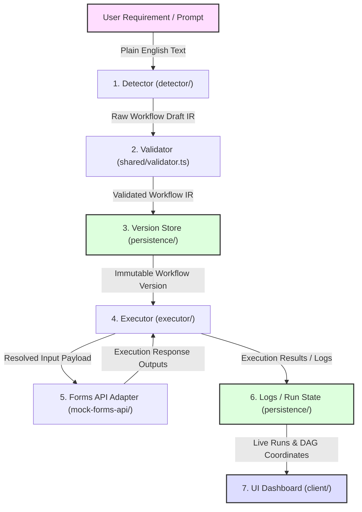

# FlowTrace Architecture

This document describes the high-level architecture of FlowTrace.

## System Topology
```text
USER → REACT FRONTEND → EXPRESS API
                         ├─ detector
                         ├─ shared validator
                         ├─ patch/version service
                         └─ executor
                              ├─ context resolver
                              ├─ conditions
                              └─ Forms API adapter
                                   ├─ existing API
                                   └─ local mock API
                         ↓
                    MongoDB persistence
```

---

## Data Flow Architecture Diagram

The diagram below details the data flow from requirement input to user visualization in the UI, mapping each step to its specific code modules and collections:



---

## Architectural Components

1. **React Frontend (`client/`)**
   - Renders a DAG visualization using React Flow.
   - Includes manual trigger interface and payload forms.
   - Displays live or polled run statuses, detailed execution logs, manual patch editing, and agent natural-language patch preview.

2. **Express API Server (`server/`)**
   - Coordinates detection, validation, execution, and versioning.
   - Exposes REST endpoints for workflows and runs.

3. **Detector (`detector/`)**
   - Converts plain-language requirements to the Intermediate Representation (IR).
   - Uses deterministic phrase/action matching as the primary fallback, with optional LLM proposal.

4. **Shared Validator (`shared/`)**
   - Validates workflow IR using Zod schemas (`shared/schemas.ts` and `shared/validator.ts`).
   - Ensures consistency between manual and agent edits.

5. **Executor (`executor/`)**
   - Executes workflow steps sequentially.
   - Resolves context variables like `{{trigger.x}}` and `{{stepId.x}}`.
   - Evaluates step conditions (`eq`, `neq`, `gt`).
   - Integrates with the Forms API Adapter (mock or real).
   - Applies failure policies (`abort`, `skip`, `redirect`).

6. **Persistence (`persistence/`)**
   - MongoDB database layout storing:
     - `workflows` (logical ID and version tracking)
     - `workflowVersions` (immutable IR configurations)
     - `runs` (trigger details, run states, step outcomes)
     - `logs` (sequential debug outputs)
     - `auditEvents` (immutable operational edits log)

7. **Mock Forms API (`mock-forms-api/`)**
   - Deterministic local mock API supporting controlled failure scenarios for the demo flow.
