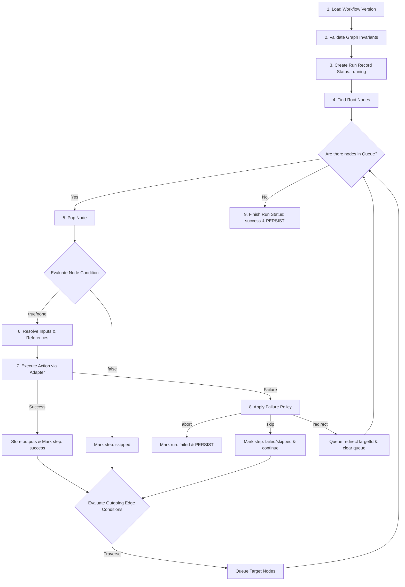

# Execution Semantics & Graph Invariants

This document outlines the validation rules and invariants required for a workflow graph to be declared valid and executable.

## Invariant Categories

### 1. Node & Edge Identifiers
*   **Unique Node IDs**: Every node must have a unique identifier in the `nodes` array. Duplicate node IDs are rejected.
*   **Unique Edge IDs**: Every edge must have a unique identifier. Duplicate edge IDs are rejected.

### 2. Edge Topology
*   **Existing References**: An edge's `source` and `target` properties must match the ID of nodes existing within the workflow graph.
*   **No Self-Loops**: An edge cannot connect a node to itself (`source === target`).
*   **Directed Acyclic Graph (DAG) Constraint**: The graph must be acyclic. Cycles of any length (e.g., A -> B -> A or A -> B -> C -> A) are forbidden.

### 3. Step References & Context Resolution
*   **Trigger References**: Input templates matching `{{trigger.x}}` are evaluated at runtime using the initial trigger payload. They are syntactically valid from any step.
*   **Prior-Step / Ancestor References**: References to other steps via `{{stepId.x}}` must satisfy:
    1.  **Existence**: The referenced `stepId` must correspond to a node present in the workflow.
    2.  **Topological Dependency**: The referenced node must be an ancestor of the referencing node in the DAG. You cannot refer to parallel branches or descendant nodes.

### 4. Failure Policies & Redirect Targets
*   **Redirect Target Existence**: If a step defines a failure policy with the `'redirect'` action, the `redirectTargetId` must exist as a valid node ID in the workflow.

---

## Validation Boundary

| State | Actionability | Criteria |
| :--- | :--- | :--- |
| **Valid Graph** | Allowed to Execute | Passes Zod schemas, contains no cycles, all edges connect valid nodes, all variable references point to ancestors. |
| **Invalid Graph** | Rejected (Throws / 422) | Violates any schema constraint or topological invariant. Execution runs cannot be started. |

---

## Detailed Execution Algorithm

When an execution run is triggered via `POST /api/workflows/:id/run`, the engine executes the following deterministic workflow sequence:



### 1. Initialization and Load
*   **Load**: Retrieve the specific `workflowVersions` document by the target `workflowVersionId` from the database.
*   **Verify**: Run `validateWorkflow` on the workflow document.
    *   *Invalid behavior*: If validation fails, abort the execution before starting. Return `422 Unprocessable Entity` containing validation errors. Do not create a database `Run` record.

### 2. Startup and Persistence
*   **Create Run**: Generate a new `Run` document:
    *   `id`: Generate unique ID.
    *   `status`: Set to `'running'`.
    *   `triggerPayload`: Load from the trigger body.
    *   `startedAt`: Set to current UTC timestamp.
    *   `results`: Initialize empty mapping `{}`.
*   **Persist**: Insert the `Run` document and stream the initial log: `"Workflow run initialized with version X"`.

### 3. Traversal Queue & Execution Loop
*   **Topological Sort**: Compute the topological order of the DAG.
*   **Execution Queue**: Create a queue containing all root nodes (nodes with 0 incoming edges).
*   **Dependency Tracking**: Keep track of the execution status of every node (success, skipped, failed). A node is eligible for execution only when all its incoming ancestor nodes have finished execution (or were skipped).

For each node popped from the queue:

#### A. Node Pre-Condition Evaluation
*   If the node has an optional `condition`:
    *   Resolve its `field` reference (e.g., `{{trigger.amount}}`).
    *   Perform comparisons:
        *   `eq`: Check if value strictly equals `value`.
        *   `neq`: Check if value strictly does not equal `value`.
        *   `gt`: Check if numeric value is greater than `value`.
    *   If the condition evaluates to `false`:
        *   Mark step as `skipped` in `results`.
        *   Append log: `"Step [ID] skipped: condition evaluated to false"`.
        *   Queue any downstream nodes connected to this node that are now eligible, and proceed to the next loop iteration.

#### B. Context Resolution
*   If the condition is met (or absent), resolve all variables inside `inputs` using regular expressions:
    *   `{{trigger.key}}` -> Replace with corresponding value from `triggerPayload`.
    *   `{{stepId.key}}` -> Replace with output value from `results[stepId].output.key` (verified to be an ancestor).

#### C. Execution
*   Call the designated Forms API adapter function with the resolved inputs.
*   Measure execution start and complete timestamps.

#### D. Success Path
*   If the API call is successful:
    *   Store the response outputs in `results[node.id] = { status: 'success', output: response, startedAt, completedAt }`.
    *   Append log: `"Step [ID] succeeded"`.
    *   Evaluate outgoing edges: If an edge has a `condition`, evaluate it. If `true` or absent, add the target node to the queue. If `false`, do not traverse that edge.
    *   Persist updated `Run` document.

#### E. Node Failure Policy Application
*   If the API call fails (returns an error, timeout, or invalid format):
    *   If `failurePolicy` is `abort`:
        *   Mark run status as `'failed'`.
        *   Store step result as `{ status: 'failed', error: error.message, startedAt, completedAt }`.
        *   Append log: `"Step [ID] failed. Failure policy 'abort' triggered. Ending workflow."`.
        *   Persist updated `Run` document.
        *   Terminate execution loop immediately.
    *   If `failurePolicy` is `skip`:
        *   Store step result as `{ status: 'skipped', error: error.message, startedAt, completedAt }`.
        *   Append log: `"Step [ID] failed. Failure policy 'skip' triggered. Continuing execution."`.
        *   Add downstream eligible nodes to the queue.
        *   Persist updated `Run` document.
    *   If `failurePolicy` is `redirect`:
        *   Store step result as `{ status: 'failed', error: error.message, startedAt, completedAt }`.
        *   Append log: `"Step [ID] failed. Failure policy 'redirect' triggered. Jumping to node [redirectTargetId]."`.
        *   Clear the current execution queue.
        *   Add the `redirectTargetId` node to the queue.
        *   Persist updated `Run` document.

### 4. Termination
*   Once the queue is empty:
    *   Set run status to `'success'` (if not aborted/failed).
    *   Set `completedAt` to current UTC timestamp.
    *   Append final log: `"Workflow run finished with status success"`.
    *   Persist updated `Run` document.

---

## Seeded Example: Asset Request Approval Workflow

### 1. Workflow Definition (IR)
```json
{
  "id": "wf_asset_request",
  "version": 1,
  "status": "published",
  "trigger": { "id": "tr_asset", "type": "manual" },
  "nodes": [
    {
      "id": "step_check_price",
      "name": "Check Item Price",
      "type": "action",
      "action": "InventoryService.getPrice",
      "inputs": { "item": "{{trigger.itemName}}" }
    },
    {
      "id": "step_require_manager_approval",
      "name": "Require Manager Approval",
      "type": "form",
      "action": "ApprovalService.request",
      "inputs": { "item": "{{trigger.itemName}}", "price": "{{step_check_price.price}}" },
      "condition": { "field": "{{step_check_price.price}}", "operator": "gt", "value": 500 },
      "failurePolicy": { "action": "redirect", "redirectTargetId": "step_reject_request" }
    },
    {
      "id": "step_approve_request",
      "name": "Approve Asset Request",
      "type": "action",
      "action": "AssetService.approve",
      "inputs": { "item": "{{trigger.itemName}}" }
    },
    {
      "id": "step_reject_request",
      "name": "Reject Request",
      "type": "action",
      "action": "AssetService.reject",
      "inputs": { "item": "{{trigger.itemName}}" }
    }
  ],
  "edges": [
    { "id": "e1", "source": "step_check_price", "target": "step_require_manager_approval" },
    {
      "id": "e2",
      "source": "step_require_manager_approval",
      "target": "step_approve_request",
      "condition": { "field": "{{step_require_manager_approval.approved}}", "operator": "eq", "value": true }
    },
    {
      "id": "e3",
      "source": "step_require_manager_approval",
      "target": "step_reject_request",
      "condition": { "field": "{{step_require_manager_approval.approved}}", "operator": "neq", "value": true }
    }
  ]
}
```

### 2. Dry Run Simulation (Trace on Paper)

#### Scenario A: High Value Request ($750) Approved by Manager
*   **Trigger Input**: `{ "itemName": "MacBook Pro" }`
*   **Step 1 (`step_check_price`)**:
    *   Resolved Input: `{ "item": "MacBook Pro" }`
    *   API Mock Return: `{ "price": 750 }`
    *   Result: `success`, output `{ price: 750 }`
*   **Step 2 (`step_require_manager_approval`)**:
    *   Pre-condition: `{{step_check_price.price}} gt 500` -> `750 gt 500` (evaluates to **true**).
    *   Resolved Input: `{ "item": "MacBook Pro", "price": 750 }`
    *   API Mock Return (Form Approval): `{ "approved": true }`
    *   Result: `success`, output `{ approved: true }`
*   **Edge Evaluation**:
    *   `e2` (target: `step_approve_request`): condition `approved eq true` -> `true eq true` (evaluates to **true**, queue target).
    *   `e3` (target: `step_reject_request`): condition `approved neq true` -> `true neq true` (evaluates to **false**, do not queue).
*   **Step 3 (`step_approve_request`)**:
    *   Resolved Input: `{ "item": "MacBook Pro" }`
    *   API Mock Return: `{ "status": "approved" }`
    *   Result: `success`
*   **Execution Complete**: Run status is set to `'success'`.

#### Scenario B: Low Value Request ($150)
*   **Trigger Input**: `{ "itemName": "Keyboard" }`
*   **Step 1 (`step_check_price`)**:
    *   Resolved Input: `{ "item": "Keyboard" }`
    *   API Mock Return: `{ "price": 150 }`
    *   Result: `success`, output `{ price: 150 }`
*   **Step 2 (`step_require_manager_approval`)**:
    *   Pre-condition: `{{step_check_price.price}} gt 500` -> `150 gt 500` (evaluates to **false**).
    *   Step marked as `skipped`.
*   **Edge Evaluation**: Since step was skipped, edges `e2` and `e3` are not traversed since their source was skipped.
*   **Execution Complete**: Run status is set to `'success'`.
